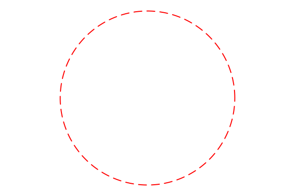

# SimpleDrawingObjects

This is a companion module to [SimpleDrawing](https://github.com/scheinerman/SimpleDrawing.jl).
Its purpose is to simplify the drawing of basic shapes. 

## Overview

This module defines some basic shapes (such as `Circle`) that can be endowed with attributes (such as line thickness and color). The underlying visualization of these objects is provided by [Plots](https://docs.juliaplots.org/stable/).

The general workflow is to (1) create a shape, (2) specify attributes for that shape, and (3) visualize it using the `draw` function.

For example:
```
using SimpleDrawingObjects, SimpleDrawing

C = Circle(2-im, 3)         # circle centered at (2,-1) with radius 3
set_linecolor!(C, :red)     
set_linewidth!(C, 2)
set_linestyle!(C, :dash)
newdraw()                   # erases the drawing window (from SimpleDrawing)
draw(C)                     # draws the circle
finish()                    # remove any axes, legends, etc. and set the aspect ratio to 1
```
Here is the result:



Note that the center of the circle is specified as a complex number. Alternatively, we 
could have used `Circle(2,-1,3)`. Note that `Circle(2,3)` is understood as `Circle(2+0im,3)` and 
would create a circle centered at `(2,0)`.

### List of supported objects  

* Line Segments
    * `Segment` 
    * `Arrow` (a `Segment` with an arrow at one end)
* Polygons
    * `Polygon`, `FilledPolygon`
    * `Rectangle`, `FilledRectangle` (for axis-parallel rectangles)
* Circles
    * `Circle` (empty interior)
    * `FilledCircle` (filled interior)
    * `Arc` (arc of a circle)
* Spline Curves
    * `OpenCurve` 
    * `ClosedCurve`
    * `FilledClosedCurve`
* Points
    * `Point`

More information on each of these is provided below. 

## Common Methods


The following functions apply to the geometric objects defined in this module.

### Drawing
The `draw` function causes the object to be drawn on the screen. 

The `draw` function may be applied to a list (vector) of objects in which case the objects
in the list are drawn in the order presented.

### Object attributes

Each `SimpleDrawingObject` has attributes that affect how it is drawn. The following methods are provided for setting object attributes:
* `set_linecolor!(o, c)` assigns the line color `c` to `o`. Default: `:black`
* `set_linewidth!(o, w)` sets the line thickness of the lines drawn to be `w`. Default: `1`. 
* `set_linestyle!(o, style)` sets the line style of `o` to `style`. Default: `solid`. 
* `set_pointsize!(p, sz)` pertains only to `Point`s and sets the size of the `Point`. Default: `2`.
* `set_pointcolor!(p, col)` pertains only to `Point`s and sets the color of the `Point`. Defaut: `:black`. 

More generally, use `set_attribute!(o, attr, val)` to set `o`'s attribute `attr` to the value `val`. Use with caution. 

Use `reset_attributes!(o)` to return `o` to its "factory default" attributes. 

The function `get_attributes(o)` returns a view into `o`'s attribute dictionary which can then be directly manipulated (if you dare).


More information on object attributes can be found in the [Plots](https://docs.juliaplots.org/stable/generated/attributes_series/) documentation. 


## Line Segments

Create a new line segment using one of these:
* `Segment(a, b)` where `a` and `b` are complex numbers.
* `Segment(x, y, xx, yy)` where the arguments are real numbers; this creates a segment from `(x,y)` to `(xx,yy)`.

* `Arrow(a, b)` creates a line segment from `a` to `b` with an arrowhead at `b`. This is equivalent to:
    * `s = Segment(a, b)`
    * `set_attribute!(s, :arrow, true)`

## Polygons

Polygons are created from a list of complex numbers. The following are equivalent
* `Polygon([1-2im, 3+im, 4, -1-im])`
* `Polygon(1-2im, 3+im, 4, -1-im)`
* `Polygon([1,3,4,-1], [-2,1,0,-1])`


The convenience function `Rectangle` creates an axis-parallel rectangle. 
* `Rectangle(a, b)` creates a rectangle with opposite corners at `a` and `b` (as complex numbers).
* `Rectangle(x, y, xx, yy)` creates a rectangle with opposite corners `(x,y)` and `(xx,yy)`. 

The interior of a `Polygon` is blank. To create a filled-in polygon, use `FilledPolygon` (as well as `FilledRectangle`).

## Circles

Circles are created from a center and a radius:
* `Circle(z, r)` is the circle centered at (complex) `z` with radius `r`. 
* `Circle(x, y, r)` is the circle centered at `(x,y)` with radius `r`. 


### Disks

Disks are called `FilledCircle`s. That is, their interior is an opaque color. Like circles, create with one of these:
* `FilledCircle(z, r)`
* `FilledCircle(x, y, r)`

The function `set_fillcolor!` can be used to change the interior color of the disk. 

The symbols `Disc` and `Disk` are synonyms for `FilledCircle`.

### Arcs

Arcs of circles are created thus with `Arc(ctr, rad, t1, t2, t3)` where:
* `ctr` is (complex) the center of the circle,
* `rad` is the radius of the circle,
* `t1` is the starting angle for the arc,
* `t2` is an angle for a point inside the arc, and
* `t3` is the ending angle for the arc.

We require the intermediante angle `t2` because simply specifying the end points of the arc does not determine which piece of the circle we are considering. 

The center can also be specified as two real numbers: `Arc(x, y, rad, t1, t2, t3)`.


## Spline Curves

The functions `ClosedCurve` and `OpenCurve` create curves from a list of points (just like `Polygon`). 
The curves are cubic splines through those points. The following are all equivalent:
* `ClosedCurve([1-2im, 3+im, 4, -1-im])`
* `CloseCurve(1-2im, 3+im, 4, -1-im)`
* `ClosedCuve([1,3,4,-1], [-2,1,0,-1])`

We also have `FilledClosedCurve` for a closed curve whose interior is colored.

## Points

Points in the plane are created with `Point(z)` or `Point(x,y)`. A `Point` is rendered as a small dot. These two functions determine the appearance of points:
* `set_pointsize!(p, sz = 2)` sets the size of the point.
* `set_pointcolor!(p, col = :black)` sets the color of the point. 

To illustrate a point whose interior color is different from its boundary, use a `Disk`. 